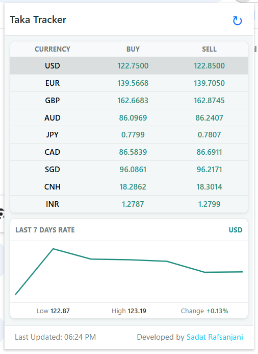

# Taka Tracker

A lightweight Chrome extension that shows today's Bangladeshi Taka (BDT) exchange rates in a compact popup, with a simple 7-day trend line for any currency you pick.

## Screenshot

<p align="center">  </p>

## Features

- **Live rates table**: currency, buy and sell rates from the Bangladesh central bank source, shown in a compact popup.
- **7-day trend line**: a simple line chart for one currency at a time. USD is selected by default, and clicking any row switches the chart.
- **Manual refresh**: a refresh button that clears the cached rates and fetches them again.
- **Loading and error states**: a spinner while loading, and a clear error message with a Retry button.
- **Flexible height**: the popup grows with its content up to Chrome's 600px popup limit, and the table area scrolls beyond that.
- **Bootstrap layout**: the interface uses Bootstrap utility classes, with a small `popup.css` that only sets theme variables.

## How it works

1. `popup.js` asks the background script for the rates page with a `GET_EXCHANGE_RATE` message.
2. The background script fetches the page and caches it in `chrome.storage.local` under `exchangeRatesCache`.
3. `popup.js` parses the HTML tables into buy and sell rows and renders them.
4. For the trend line, it requests the last several days of reference rates from the [Frankfurter API](https://frankfurter.dev) (free, no API key) and converts each currency to BDT.

## Data sources

| Data | Source |
|---|---|
| Buy and sell rates in the table | Bangladesh central bank rates page, fetched by the background script |
| 7-day trend line | Frankfurter API (`api.frankfurter.dev`) |

The trend line plots market reference rates, not the bank's buy and sell rates, so its shape can differ slightly from the table. Some currencies have no data on weekends, so a line can contain fewer than 7 points.

## Installation (developer mode)

1. Clone or download this repository.
2. Open `chrome://extensions` in Chrome.
3. Turn on **Developer mode** (top right).
4. Click **Load unpacked** and select the project folder.
5. Pin **Taka Tracker** to the toolbar and click its icon.

## Project structure

```
taka-tracker/
├── manifest.json
├── popup.html
├── background.js            # fetches and caches the rates page
├── css/
│   ├── bootstrap.min.css
│   └── popup.css            # Bootstrap theme variables only
├── js/
│   ├── jquery.min.js
│   ├── bootstrap.bundle.min.js
│   └── popup.js             # table, chart and UI logic
├── LICENSE
└── README.md
```

## Permissions

| Permission | Why it is needed |
|---|---|
| `storage` | Caches the rates page in `chrome.storage.local` |
| Host access to the rates source | Lets the background script fetch the rates page |
| Host access to `https://api.frankfurter.dev/*` | Lets the popup fetch 7-day history for the trend line |

The extension does not collect, store or send any personal data.

## Configuration

Both settings are constants at the top of `js/popup.js`:

```js
const HISTORY_DAYS = 7;                    // number of plotted days
const HIDDEN_CURRENCIES = ["LKR", "SEK"];  // currencies removed from the table and chart
```

To hide another currency, add its 3-letter code to `HIDDEN_CURRENCIES`.

## Limitations

- The trend line needs a 3-letter currency code (for example `USD`) in the Currency column. Rows without one show "No history available for this currency."
- The table depends on the layout of the source page. If the source changes its HTML, the parsing in `extractRates` may need updating.
- Chrome caps extension popups at 600px in height.

## Disclaimer

Rates are shown for information only and may be delayed or differ from the rates offered by banks and exchange houses. Do not use this extension as the sole basis for financial decisions.

## Third-party libraries

- [Bootstrap](https://getbootstrap.com) (MIT)
- [jQuery](https://jquery.com) (MIT)
- [Frankfurter](https://frankfurter.dev) API for historical rates

## License

Released under the [MIT License](LICENSE).

Developed by [Sadat Rafsanjani](https://sadatrafsanjani.github.io).
